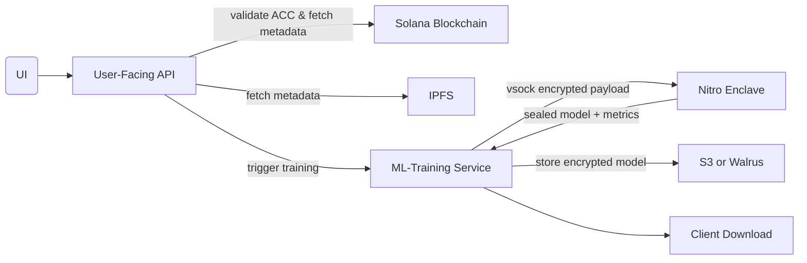

## 1. Architecture Overview

The overarching goal of the OutDated Platform is to enable **secure, permissioned machine-learning** on private datasets—packaged and licensed as NFTs—without ever exposing raw data or model internals outside a Trusted Execution Environment (TEE). In practice, that means:

- **For Dataset Providers**:
    - They can upload and encrypt sensitive data, define on-chain access-control conditions (ACCs) via Lit Protocol, and mint NFTs that represent time-bound or usage-bound licenses.
- **For Consumers (Developers/Researchers)**:
    - They connect their wallet, purchase a dataset license NFT on Solana, and then invoke a simple `SecureModel.fit("walrus://<dataset_hash>")` API. Under the hood, the data remains encrypted until it’s decrypted **only inside** an AWS Nitro Enclave, trained on, and then re-sealed, so neither the platform operators nor anyone on the public internet ever sees your plaintext data or model weights.
- **For Admins**:
    - They monitor access logs, manage or revoke ACCs/NFTs, and ensure compliance, all while upholding the principle that **data confidentiality** is enforced by hardware isolation and cryptographic policies, not by trust in any single operator.

By splitting the system into a user-facing API service and a dedicated, highly auditable ML-training service backed by Nitro Enclaves, the platform achieves a secure, scalable, and user-friendly way to commercialize and consume private datasets for machine learning, bridging Web3 licensing with real-world confidentiality guarantees.

### 1.1 Two-Service Split

- **User-Facing API Service**
    - Exposes wallet connect, dataset discovery, NFT mint/purchase, ACC definition, and admin monitoring endpoints.
    - Validates user ACCs via Lit Protocol PKP [Overview | Lit Protocol](https://developer.litprotocol.com/sdk/authentication/session-sigs/get-pkp-session-sigs?utm_source=chatgpt.com).
    - Interacts with Solana for NFT minting/purchase and with Walrus for metadata retrieval [mystenlabs.github.io](https://mystenlabs.github.io/walrus-docs/?utm_source=chatgpt.com).
- **ML-Training Service**
    - Exposes training endpoints (`/train`, `/train/{id}/status`, etc.).
    - Launches/manages AWS Nitro Enclaves for secure compute [Amazon Web Services, Inc.](https://aws.amazon.com/ec2/nitro/nitro-enclaves/?utm_source=chatgpt.com).
    - Communicates with enclave over vsock to decrypt, train, and seal models.

### 1.2 Data & Control Flows



---

## 2. Components & Tech Stack

| Layer | Technology / Service |
| --- | --- |
| Frontends | React / Next.js + TailwindCSS; Solana Wallet Adapter |
| User API | Node.js (Express) or Python (FastAPI) |
| ML API | Python (Flask/FastAPI) on EC2 with Nitro Enclaves enabled [Amazon Web Services, Inc.](https://aws.amazon.com/ec2/nitro/nitro-enclaves/?utm_source=chatgpt.com) |
| Storage | Walrus (encrypted blobs) [mystenlabs.github.io](https://mystenlabs.github.io/walrus-docs/?utm_source=chatgpt.com); IPFS for metadata |
| Blockchain | Solana + Metaplex for NFT mint/list [Web3 Infrastructure for Everyone](https://solana.com/docs?utm_source=chatgpt.com) [Medium](https://medium.com/javarevisited/solana-nft-marketplace-development-a-comprehensive-guide-2023-7de21e522cd7?utm_source=chatgpt.com) |
| Access Control | Lit Protocol PKP & ACC definitions [Overview | Lit Protocol](https://developer.litprotocol.com/sdk/authentication/session-sigs/get-pkp-session-sigs?utm_source=chatgpt.com) [Overview | Lit Protocol](https://developer.litprotocol.com/sdk/serverless-signing/combining-signatures?utm_source=chatgpt.com) |
| Confidential Compute | AWS Nitro Enclaves (vsock channel only) [Amazon Web Services, Inc.](https://aws.amazon.com/ec2/nitro/nitro-enclaves/?utm_source=chatgpt.com) |
| Security | HTTPS/mTLS between services; IAM + KMS policies; OWASP Microservices Security [OWASP Cheat Sheet Series](https://cheatsheetseries.owasp.org/cheatsheets/Microservices_Security_Cheat_Sheet.html?utm_source=chatgpt.com) [Okta](https://www.okta.com/resources/whitepaper/8-ways-to-secure-your-microservices-architecture/?utm_source=chatgpt.com) |

---

## 3. API Reference

### 3.1 User-Facing API Endpoints

### Authentication & Wallet

- **POST** `/auth/connect-wallet`
    
    ```json
    json
    CopyEdit
    { "wallet_address": "..." }
    
    ```
    
    Establishes user session via JWT.
    

### Marketplace & Datasets

- **GET** `/datasets`
    
    List all published datasets with metadata (price, tags, ACC id).
    
- **GET** `/datasets/{dataset_hash}`
    
    Retrieve detailed metadata from IPFS.
    
- **GET** `/nft/{wallet_address}`
    
    List dataset NFTs owned by user.
    
- **POST** `/nft/purchase`
    
    Payload: `{ "dataset_hash": "...", "tx_signature": "..." }`
    
    Backend listens for NFT transfer event to grant ACC.
    

### Provider Workflows

- **POST** `/provider/dataset/upload`
    
    Upload & encrypt dataset, store to Walrus [mystenlabs.github.io](https://mystenlabs.github.io/walrus-docs/?utm_source=chatgpt.com).
    
- **POST** `/provider/dataset/acc`
    
    Define ACC rules via Lit SDK.
    
- **POST** `/provider/dataset/mint`
    
    Mint Solana NFT (Metaplex), returning mint address [Medium](https://medium.com/javarevisited/solana-nft-marketplace-development-a-comprehensive-guide-2023-7de21e522cd7?utm_source=chatgpt.com).
    
- **GET** `/provider/datasets`
    
    List provider’s datasets and statuses.
    

### Admin Controls

- **GET** `/admin/logs`
    
    View access and decryption logs.
    
- **POST** `/admin/revoke-nft`
    
    Revoke ACC & NFT license rights.
    
- **POST** `/admin/update-acc`
    
    Modify ACC policies.
    
- **GET** `/admin/metrics`
    
    Platform stats (#jobs, #datasets, usage).
    
- **POST** `/admin/notify-users`
    
    Broadcast messages or alerts.
    

### 3.2 ML-Training Service Endpoints

- **POST** `/train`
    
    ```json
    json
    CopyEdit
    {
      "dataset_hash": "...",
      "algorithm": "random_forest",
      "params": { "n_estimators": 100 }
    }
    
    ```
    
    Validates ACC, fetches encrypted data, streams package into enclave over vsock, returns `job_id`.
    
- **GET** `/train/{job_id}/status`
    
    `{ "status": "pending"|"running"|"complete"|"failed" }`.
    
- **GET** `/train/{job_id}/metrics`
    
    Returns sealed metrics blob (accuracy, loss).
    
- **GET** `/train/{job_id}/model`
    
    Download encrypted model artifact.
    

*All endpoints follow REST best practices: resource-oriented paths, standard HTTP status codes, and JSON I/O [Stack Overflow Blog](https://stackoverflow.blog/2020/03/02/best-practices-for-rest-api-design/?utm_source=chatgpt.com).*

---

## 4. Security Considerations

- **Network Isolation**
    - Place services in private VPC subnets; only User API can call ML API on port 443 or 5000 [AWS Documentation](https://docs.aws.amazon.com/whitepapers/latest/microservices-on-aws/microservices-on-aws.html?utm_source=chatgpt.com).
    - Nitro Enclave has no public network—vsock only [Amazon Web Services, Inc.](https://aws.amazon.com/ec2/nitro/nitro-enclaves/?utm_source=chatgpt.com).
- **Authentication & Authorization**
    - JWT or mTLS for inter-service calls; OAuth2/OpenID Connect for user sessions.
    - Enforce ACC proofs through Lit Protocol PKP before training [Overview | Lit Protocol](https://developer.litprotocol.com/sdk/authentication/session-sigs/get-pkp-session-sigs?utm_source=chatgpt.com).
- **Encryption & Key Management**
    - Datasets encrypted at rest in Walrus; data keys stored in KMS with enclave-only decrypt policies [Amazon Web Services, Inc.](https://aws.amazon.com/solutions/guidance/secure-blockchain-key-management-with-aws-nitro-enclaves/?utm_source=chatgpt.com).
    - TLS everywhere, scanning deps for vulnerabilities [Okta](https://www.okta.com/resources/whitepaper/8-ways-to-secure-your-microservices-architecture/?utm_source=chatgpt.com).
- **Logging & Auditing**
    - Immutable logs of ACC validations, enclave attestations, and model seals.
    - Admin dashboard surfaces suspicious activity.
- **API Best Practices**
    - Versioning via `/v1/...` prefix; document with OpenAPI 3.0 spec [Postman API Platform](https://www.postman.com/api-platform/api-versioning/?utm_source=chatgpt.com) [Swagger](https://swagger.io/docs/specification/v3_0/basic-structure/?utm_source=chatgpt.com).
    - Rate limiting, input validation, clear error messages.

---

## 5. Deployment & CI/CD

### 5.1 Infrastructure as Code

- Use Terraform or CloudFormation to provision:
    - VPC with public/private subnets.
    - EC2 Auto Scaling for User API (e.g. t3.medium).
    - EC2 with Nitro Enclaves for ML API (e.g. c6g.4xlarge) [Amazon Web Services, Inc.](https://aws.amazon.com/solutions/guidance/secure-blockchain-validation-using-aws-nitro-enclaves/?utm_source=chatgpt.com).
    - S3 buckets for model storage; KMS keys with enclave policies.

### 5.2 Enclave Image Build

- Dockerfile installs:
    
    ```docker
    
    FROM public.ecr.aws/lambda/python:3.9
    RUN pip install aws-nitro-enclaves-sdk aws-encryption-sdk boto3 cryptography numpy scikit-learn
    
    ```
    
- Build EIF with `nitro-cli build-enclave` [Amazon Web Services, Inc.](https://aws.amazon.com/ec2/nitro/nitro-enclaves/?utm_source=chatgpt.com).

### 5.3 CI/CD Pipelines

- **User API**: Run lint/tests, build Docker image, deploy to ECS/EKS or EC2 via GitHub Actions.
- **ML API**: Build & test enclave Docker, build EIF, push to ECR, deploy host with nitro-cli launch scripts.
- **OpenAPI Spec**: Validate and publish docs via Swagger UI on `/docs`.

---

## 6. Sample OpenAPI Snippet

```yaml

openapi: 3.0.4
info:
  title: OutDated Platform API
  version: 1.0.0
paths:
  /train:
    post:
      summary: Launch ML training job
      requestBody:
        required: true
        content:
          application/json:
            schema:
              $ref: '#/components/schemas/TrainRequest'
      responses:
        '202':
          description: Job accepted
          content:
            application/json:
              schema:
                $ref: '#/components/schemas/TrainResponse'
components:
  schemas:
    TrainRequest:
      type: object
      properties:
        dataset_hash:
          type: string
        algorithm:
          type: string
        params:
          type: object
    TrainResponse:
      type: object
      properties:
        job_id:
          type: string

```

